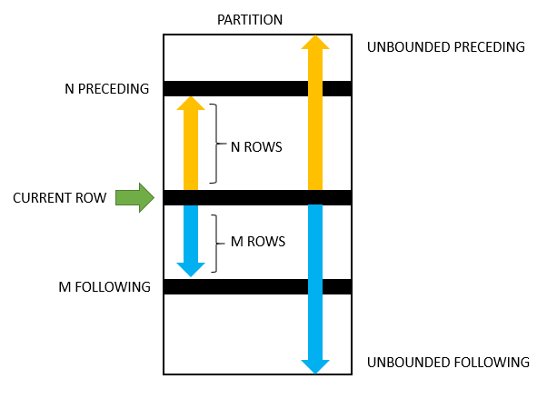

# SQL Language

## VScode SQLTools formatter settings
```
"sqltools.format": {
  "linesBetweenQueries": "preserve"
}
```

## Schema
```
drop schema if exists DATABASE;
create schema DATABASE;
use DATABASE;
```

## Table
```
drop table if exists TABLE;

create table TABLE (
  FIELD int [not null] [auto_increment | default = EXPR],,,
  FIELD int generated always as (EXPR),
  constraint CONSTRAINT primary key (FIELD,,,),
  constraint CONSTRAINT foreign key (FIELD,,,) references TABLE (FIELD,,,)
);

create [unique] index INDEX on TABLE (FIELD,,,);
```

## CRUD
```
select [distinct] FIELD,,, from TABLE
  [window WINDOW as (WINDOW_SPEC),,,]
  [where EXPR] 
  [group by FIELD,,,] 
  [having EXPR]
  [order by FIELD [desc],,,]
  [limit N] [offset K];

with A as (select ...) select ...;
create [or replace] view VIEW as select ...;

select EXPR into @VARIABLE ...;

insert into TABLE (FIELD,,,) values (VALUE,,,),,,;
insert into TABLE (FIELD,,,) select FIELD,,, ...;

update TABLE set FIELD=VALUE,,, [where EXPR];

delete from TABLE where EXPR;

select ... union [all] select ...;
```

## Expression
```
select ...
  where FIELD op VALUE
        FIELD between VALUE and VALUE
        FIELD is [not] null
        FIELD like PATTERN        -- "abc%", "abc_", "[abc]", "[!abc]" 
        FIELD regexp REGEXP 
        FIELD [not] in (VALUE,,,)
        FIELD [not] in (select ...)
        FIELD OP [any | all] (select ...)
```

## Join
```
select ...
  from (A [left | inner | right | outer] join B on A.FIELD=B.FIELD) as C
  from (A [left | inner | right | outer] join (select ...) as B on A.FIELD=B.FIELD) as C
```

## Grouping and aggregate functions
Goal: group and aggregate data to create summary rows.

### Example
```
select office_id, avg(salary) as avg_salary from employees group by office_id;
```

## Partition and window functions
https://www.mysqltutorial.org/mysql-window-functions/  

Goal: calculate aggregates while keeping individual rows.  
Same result can sometimes be emulated by `inner join` with a `group by` subquery. However, `over` is often more efficient and concise.  
Window functions are performed AFTER `join`, `where`, `group by`, `having` clauses, and BEFORE `order by`, `limit`, `select distinct`
```
window_function_name(EXPR) <over_clause>

over_clause ::= over (<window_spec>) | over <window_name>
window_spec ::= <window_name> <partition_defintion> <order_definition> <frame_definition>
partition_defintion ::= partition by EXPR,,,
order_definition    ::= order by EXPR [asc|desc],,,
```
A frame is a subset of the current partition. A frame is defined with respect to the current row.
```
frame_clause   ::= <frame_units> <frame_extent>
frame_units    ::= rows | range
frame_extent   ::= {<frame_start> | <frame_between>}
frame_between  ::= between <frame_start> and <frame_end>
frame_start,frame_end ::= 
  | current row
  | unbounded prceding
  | EXPR prceding
  | unbounded following
  | EXPR following
```
Default frame WITH `order by` present:
```
range between unbounded preceding and current row
```
Default frame WITHOUT `order by` present:
```
range between unbounded preceding and unbounded following
```

### Window functions
```
row_number()

rank()
dense_rank()
percent_rank()

first_value(FIELD)
nth_value(FIELD, N) from first over (...)
last_value(FIELD)

lag(FIELD, OFFSET=1, DEFAULT=NULL)
lead(FIELD, OFFSET=1, DEFAULT=NULL)

ntile(N)     -- split result set in N buckets 1..N 
cume_dist()  -- row_number()/total_rows
```
### Example
```
select first_name, salary, office_id,
  avg(salary) over (partition by office_id) as avg_salary
from employees;

select first_name, salary, office_id,
  avg(salary) over w as avg_salary
from employees
window w as (partition by office_id);

select e.first_name, e.salary, e.office_id, s.avg_salary 
from employees e
inner join (
    select office_id, avg(salary) as avg_salary 
    from employees
    group by office_id) s 
  on e.office_id = s.office_id;
```
### Partition frame
A frame is a subset of the current partition.


## Transactions
```
start transaction;

select ...;
insert ...;
update ...;
delete ...;

if (@correct) then
  commit;
else
  rollback;
end if;
```

## Functions
```
create function FUNCTION(VARIABLE varchar(40))
  returns varchar(40) deterministic
  return concat(upper(substr(VARIABLE, 1, 1)), lower(substr(VARIABLE, 2)));

select FUNCTION(FIELD) as FIELD,,, ...;
```

## Procedures
```
delimiter ;;

create procedure PROCEDURE(in VARIABLE varchar(128))
begin
  declare EXCEPTION condition for sqlstate value '45000';
  signal EXCEPTION set message_text = VARIABLE;
end ;;

delimiter ;

call PROCEDURE('My exception message text');
```
